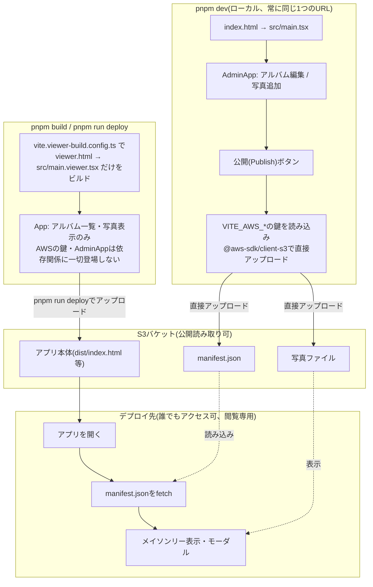
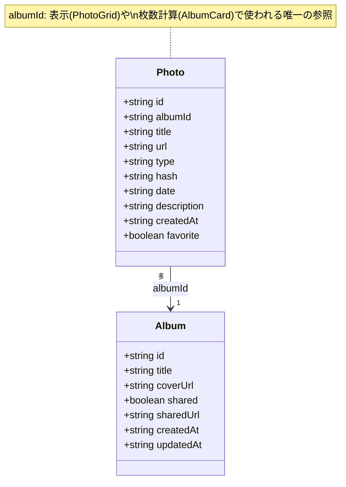

# photo-showcase

Vite + React + TypeScriptで作った、旅行アルバムを周りの人に見せるためのアプリ。

## 写真公開機能(S3連携)設計案

周りの人に旅行アルバムを見せるため、写真とアプリをS3で公開する機能の設計メモ。ログイン機能は使わず、ローカル環境(管理者)とデプロイ先(閲覧者)で振る舞いを分ける方式を採用。

### 進捗

**Phase 1: データモデル整理 + 管理者UI出し分け(完了・マージ済み)**
ブランチ: `refactor/admin-mode-foundation`(mainにマージ済み)

**Phase 2: S3公開機能(完了・マージ済み)**
残作業: S3上の削除済み写真ファイルのクリーンアップ(下記チェックリスト参照)、ダミーデータを実際の写真に差し替え

### やること一覧

**インフラ(夫と一緒に)**

1. S3バケットを1つ作る(公開読み取り可)(完了: `photo-showcase-612708912687-us-east-1-an`)
2. 自分専用のAWSアカウント/IAMユーザーを発行してもらう(バケットへの書き込み権限のみ)(完了、`.env` に格納・gitignore済み)
3. S3の「静的ウェブサイトホスティング」を有効にする(アプリ自体を置くため)(完了)
   公開URL: http://photo-showcase-612708912687-us-east-1-an.s3-website-us-east-1.amazonaws.com
   (Index document: `index.html` / Error document: `index.html`(SPAのクライアントサイドルーティング対応)、Bucket policyで `s3:GetObject` を全員に許可済み)

GitHub ActionsによるS3への自動デプロイ、AWS CLIのセットアップは不要と判断し対象から外した(理由は後述の「AWS鍵の扱いについて」を参照。既存の [biome.yml](.github/workflows/biome.yml) によるlintチェックの自動化とは無関係で、そちらは今まで通り継続する)。

**アプリ側**

- [x] データモデルの整理: `Photo.albumId` と `Album.photoIds` の二重管理を解消し、`Photo.albumId` を唯一の正とする
- [x] 管理者専用UI(インポート・削除・編集ボタンなど)を `import.meta.env.DEV` で出し分ける
- [x] `src/main.tsx`(ローカル`pnpm dev`のデフォルト。常に管理用の`AdminApp`を描画)と `src/main.viewer.tsx` + `viewer.html`(公開ビルド専用の入り口。`App`のみを描画し、AWS関連コードを一切importしない)にエントリを分ける。**別URLを開く必要はなく、`pnpm dev`はこれまで通り1つのURLのまま**
- [x] `vite.viewer-build.config.ts` を作り、`pnpm build` がこの`viewer.html`だけをビルド対象にするよう変更する(出力後に`dist/viewer.html`を`dist/index.html`にリネーム)。これにより「うっかり管理用の内容ごとビルドしてしまう」という事故が構造的に起きなくなる
- [x] `AdminApp`に「公開(Publish)」ボタンを実装する。現在のアルバム状態から `manifest.json` を生成し、写真ファイルとあわせて `@aws-sdk/client-s3` で直接S3にアップロードする。すでにS3にある写真ファイルはスキップし差分のみアップロード(manifest.jsonは毎回全体を上書き)。1枚失敗しても他の写真の公開は止めず、失敗分はスキップして続行する
- [x] `pnpm run deploy` スクリプト(`scripts/deploy.mjs`)を作る(`pnpm build`の出力である`dist/`をS3にアップロードする)
- [x] 閲覧用エントリ(`src/main.viewer.tsx`)は常にS3の`manifest.json`をfetchして表示する
- [x] (改善) ローカルストレージへの永続化: `useAlbumsStore`/`usePhotosStore`に`persist`を追加。起動時は「ローカルストレージ→S3のmanifest.json→ダミーデータ」の優先順位で復元する
- [x] (バグ修正) `manifest.json`がブラウザにキャッシュされ、Publish後も古い内容が表示される問題を修正(S3側で`CacheControl: "no-cache"`を指定、fetch側で`cache: "no-store"`を指定)
- [ ] (改善) S3上の削除済み写真ファイルのクリーンアップ: Publish時、ローカルにもう存在しない写真ファイルをS3から実際に削除する(`ListObjectsV2Command` / `DeleteObjectsCommand`。IAM権限に`s3:ListBucket`/`s3:DeleteObject`が必要な可能性あり)

**今後の検討事項**

- サブドメイン(`photos.kkoisland.com`など)にするかどうか(保留中、今のS3のURLのままでも動作する)
- 複数回に分けてImportし、まとめてPublishする運用にしたい場合の対応(サーバーが必要になり大掛かりになるため保留。当面は「Importしたら必ずPublishする」運用で回避する。やるかどうかは未定)
- ドラッグ&ドロップでのインポート対応

**AWS鍵の扱いについて(重要)**

「公開」はReactアプリ内のボタンとして実装するが、**「ローカルで動かすもの」と「ビルドしてS3に上げるもの」で、実際に使われるエントリファイル自体を分離**することで安全性を保つ。

- `pnpm dev` は常に `src/main.tsx` → `AdminApp` を描画する。ここには `VITE_AWS_ACCESS_KEY_ID` などの鍵を読み込み、S3へ直接アップロードする処理が含まれる。**このエントリは`pnpm dev`(開発サーバー)以外の方法でビルド・どこかへのアップロードを絶対に行わない**(そのため`.env`には`VITE_`接頭辞ありのキーを別途追加する)
- `pnpm build`(および`pnpm run deploy`)は `vite.viewer-build.config.ts` を使い、`viewer.html` → `src/main.viewer.tsx` → `App` のみをビルド対象にする。このモジュールの依存関係の中に、`AdminApp`やAWSの鍵を読み込む処理は一切登場しないため、ビルド成果物にも鍵の文字列は含まれない
- 「表示を条件分岐で隠す」のではなく、「そもそもビルドの材料(import)に含まれない」という構造で保証している点がポイント(詳しくは下記システム構成を参照)
- GitHub Secretsに書き込み権限のあるAWSの鍵を登録する必要もない(夫の方針)。AWSの鍵は常に自分のPCの `.env` にしか存在しない

**運用の流れ(完成後)**

- `pnpm dev` でアルバムを編集 → 「公開」ボタンでS3へ直接アップロード(同じURL、別の入り口を開く必要はない)
- アプリ自体の反映は `pnpm run deploy` を実行(`pnpm build`の安全な成果物をS3にアップロード)

### ページ構成

ルーティングは変更せず、既存ページ内の要素を管理者かどうかで出し分ける。

| ページ | 管理者のみ表示 | 誰でも表示 |
|---|---|---|
| `/albums` (AlbumGrid) | 新規インポートボタン、3点メニュー(削除・名前変更・エクスポート) | アルバム一覧 |
| `/albums/:albumId` (PhotoGrid) | 削除ボタン、追加インポート | メイソンリー表示 |
| PhotoModal | 削除ボタン、「カバーに設定」 | 拡大表示、前後移動 |
| Header(**`pnpm dev`で開いたときのみ**) | 「公開(Publish)」ボタン | ― |

「公開」ボタンは、`pnpm dev`(ローカル)で動く`AdminApp`にのみ存在する。`pnpm build`/`pnpm run deploy`でS3にアップロードされる方(`App`)にはこのボタン自体、それを支えるコードも一切含まれない。URLはどちらも同じで、別のページを開く必要はない。アプリ自体のデプロイは `pnpm run deploy` というターミナルコマンドで行う(理由は後述)。

### システム構成

`pnpm dev`(ローカル)と`pnpm build`/`pnpm run deploy`(公開用)は、同じ`localhost`のURLでも、実際にビルドの起点として使うエントリファイル(`src/main.tsx` vs `src/main.viewer.tsx`)がそもそも別物であるように設計している。`pnpm build`が辿るモジュールの依存関係の中に`AdminApp`やAWSの鍵を読み込む処理は一切登場しないため、公開されるJSファイルにも鍵の文字列は含まれない。「表示を隠す」のではなく「ビルドの材料に含まれない」という構造で保証している点がポイント。GitHub Actionsは使わない(既存のBiome lintチェックのworkflowのみ従来通り継続)。

### クラス構成

`Photo.albumId` を唯一の正とするデータモデル(Phase 1で実装済み)。以前は `Album.photoIds` にも同じ関係を重複して持っており、削除処理などで同期が崩れる問題があったため廃止した。

### 検討した選択肢(初期案)

アプリはGitHub Pagesにおき、写真をS3に置く場合(gh-pagesを使って手動で公開する):

1. S3バケットを1つ作る(公開読み取り可)
2. 自分専用のAWSアカウント/IAMユーザーを発行してもらう(そのバケットへの書き込み権限のみ)
3. AWS CLIのセットアップ(ターミナルから `aws s3 sync` でファイルをアップロードできるようにする)
4. CORSの設定(ブラウザからJSONファイルをfetchするので、そのままだとブロックされることがある)
5. 写真ファイルを実際にアップロードし、そのS3 URLを含むJSON(マニフェスト)を作る仕組みを用意する
6. `main.tsx` の編集
7. gh-pagesで公開

S3にアプリも写真も置く場合(採用案):

1. S3バケットを1つ作る(公開読み取り可)
2. 自分専用のAWSアカウント/IAMユーザーを発行してもらう(そのバケットへの書き込み権限のみ)
3. S3の「静的ウェブサイトホスティング」を有効にする(← アプリ自体を置くために追加)
4. AWS CLIのセットアップ(写真を手動アップロードするため)
5. GitHub Actionsのworkflowを作成し、AWSの認証情報をGitHub Secretsに登録する(← 自動デプロイのために追加)
6. 写真ファイルを実際にアップロードし、そのS3 URLを含むマニフェストJSONを作る仕組みを用意する
7. `main.tsx` の編集(S3のJSONをfetchするように変更)
8. `git push` する → GitHub Actionsが自動でビルド・S3へ反映(以降、編集のたびにこのpushだけでOK)

後者を採用した理由: アプリとデータを同一オリジン(S3)にまとめることで、CORS設定が不要になるため。なお、この案では当初「GitHub Actionsでpushするだけ自動デプロイ」を想定していたが、AWSの書き込み鍵をGitHub Secretsに置きたくないという判断から、ローカルからの手動コマンド(`pnpm run publish` / `pnpm run deploy`)に変更した。

その後さらに、「写真の公開もアプリ内のボタンで完結させたい(ターミナル操作は現実的でない)」という要望から、`pnpm run publish`(Node.jsスクリプト)も廃止し、管理用/閲覧用でViteのビルドエントリ自体を分離する方式に変更した。

最後に、「`admin.html`のような別URLを開かせる必要はなく、公開ビルドからAWS関連コードさえ除外できればよい」という指摘を受け、`admin.html`という別ファイルは廃止した。代わりに`pnpm dev`(ローカル)は常に`src/main.tsx`(管理用)を使い、`pnpm build`/`pnpm run deploy`だけが専用の設定(`vite.viewer-build.config.ts`)で`src/main.viewer.tsx`(閲覧用)をビルドするようにした。これにより、日常的に開くURLは1つのままで、安全性の担保(ビルドの依存関係にAWS関連コードが含まれない)はそのまま維持している(現行案)。詳細は上記「AWS鍵の扱いについて」を参照。
